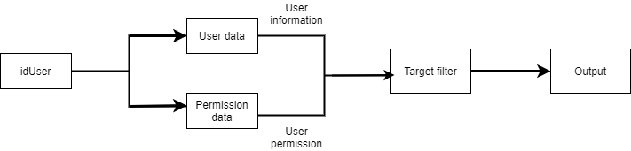

<p align="center">
  <a href="http://nestjs.com/" target="blank"></a>
</p>
## Tổng quan
Đây là ví dụ cách phân quyền dữ liệu cho người dùng. Cài đặt trên nền **Nestjs**

## Cài đặt

```bash
$ npm install
```

## Sử dụng

```bash
# development
$ npm run start

# watch mode
$ npm run start:dev

# production mode
$ npm run start:prod
```

## Xem kết quả:
  - Truy cập vào [http://localhost:3000/data/view-all](http://localhost:3000/data/view-all) để xem kết quả sau khi lọc dữ liệu của toàn bộ user.
  - Vào `http://localhost:3000/data/view/:id` để xem kết quả lọc dữ liệu của người dùng với idUser là id

## Mô tả chi tiết

**1. Vấn đề:**

- Một người dùng có các thành phần dịnh danh là idUser (số id cá nhân), idUnit (id của đơn vị), idOrg (id của tổ chức).
- Yêu cầu: với mỗi người dùng, khi đưa dữ liệu đầu vào là idUser vào hệ thống thì kết quả trả ra sẽ là những thông tin đơn vị mà người đó có quyền truy cập vào xem và lấy dữ liệu đó ra dưới dạng JSON.
- Mô tả: mỗi người dùng có quyền truy cập vào lượng dữ liệu nhất định; bao gồm quản lí chính dữ liệu của đơn vị của mình (self), quản lí dữ liệu đơn vị con của đơn vị mình (child) và bao nhiêu level (child-1,...) hoặc quản lí toàn bộ đơn vị của mình và đơn vị con; quyền đặc biệt là quản lí trên đơn vị khác của cùng tổ chức hoặc đơn vị khác tổ chức (có thể là all, self, child hoặc theo level của child).

**2. Tổ chức dữ liệu:**

- Toàn bộ dữ liệu được tổ chức dưới dạng JSON.
- Chia thành các file như sau:

  _ **orgazination.json:** dữ liệu tổ chức
  ```js 
  { 
    "idOrg": "01", 
    "name": "Orgazination-1"
  }
  ```

  _ **user.json:** dữ liệu người dùng
  ```js 
  { 
    "idUser": "U3", 
    "idOrg": "03", 
    "idUnit": "09" 
  }
  ```

  _ **unit.json:** dữ liệu đơn vị (cây biểu diễn dưới dạng mảng một chiều)
  ```js 
  { 
    "idUnit": "10", 
    "idOrg": "01", 
    "idParent": "01", 
    "name": "Unit-10" 
  }
  ```

  _ **permission-data.json:** dữ liệu quyền của người dùng
  ```js 
  { 
    "idOrg": "01", 
    "type": "special", 
    "idUser": "U1" 
  }
  ```

  _ **special-permission.json:** dữ liệu quyền đặc biệt của người dùng
  ```js 
  { 
    "idUser": "U4", 
    "idRootUnit": "05", 
    "type": "self" 
  }
  ```

**3. Giải thích cách tổ chức dữ liệu quyền người dùng:**
- **permission.json**:
  - Định nghĩa các quyền cơ bản của người dùng.
  - Các quyền này chỉ bao gồm các quyền quản lí cơ bản trên tổ chức và đơn vị của bản thân đang trực thuộc.
  - **_type_**:
    - _self_: Chỉ quản lí dữ liệu của đơn vị mình đang thuộc
    - _child_: Quản lí đơn vị con của mình
    - _child-n_: Quản lí đơn vị con của mình theo bậc (n là số bậc)
    - _all_: Quản lí toàn bộ đơn vị con và đơn vị của mình
    - _special_: Quản lí với quyền đặc biệt. (xem mục [special-permission.json](#special-permission.json))
  - **_idOrg_**: id tổ chức mà người có **_idUser_** được quyền quản lí
- **special-permission.json**:
  - Định nghĩa quyền đặc biệt của người dùng.
  - Chỉ được truy cập khi người dùng có quyền (type) là _special_
  - Các quyền đặc biệt định nghĩa khi người dùng quản lí dữ liệu của đơn vị khác có cùng tổ chức hoặc thuộc tổ chức khác.
  - **_idRootUnit_**: id đơn vị khác mà người dùng có **_idUser_** được quyền quản lí.
  - **_type_**:
    - _self_: Chỉ quản lí dữ liệu của _idRootUnit_
    - _child_: Quản lí đơn vị con của _idRootUnit_
    - _child-n_: Quản lí đơn vị con của _idRootUnit_ theo bậc (n là số bậc)
    - _all_: Quản lí toàn bộ đơn vị con và đơn vị của _idRootUnit_

**4. Cách cấu hình cho một người dùng:**

- Ví dụ tạo người dùng:
  - Thuộc tổ chức 03, đơn vị 07
  - Quyền truy cập:
    - Quản lí đơn vị bản thân (mặc định)
    - Quản lí toàn bộ cây đơn vị 08 thuộc tổ chức 03
    - Quản lí con của cây đơn vị 09 thuộc tổ chức 03
    - Quản lí toàn bộ cây đơn vị 01 thuộc tổ chức 01
    - Quản lí đơn vị con của đơn vị 02 thuộc tổ chức 01 (1 bậc)
    - Quản lí đơn bị 04 thuộc tổ chức 02 (chỉ 04)
- Bước 1: Tạo dữ liệu người dùng 
  
  Thêm vào user.sjon: 
  ```js
  {
      "idUser": "U11",
      "idOrg": "03",
      "idUnit": "07"
  }
  ```
  Thêm vào list-user.json: 
  ```js 
  "U11" 
  ```
- Bước 2: Tạo dữ liệu quyền người dùng (permission.json)
  - Quản lí đơn vị bản thân (mặc định):
    ```js
    {
      "idOrg": "03",
      "type": "self",
      "idUser": "U11"
    }
    ```
  - Người dùng có quyền đối với các đơn vị khác trong cùng tổ chức 03 nên thêm một quyền là:
    ```js
    {
      "idOrg": "03",
      "type": "special",
      "idUser": "U11"
    }
    ```
  - Người dùng có quyền đối với các đơn vị khác trong cùng tổ chức 01 nên thêm một quyền là:
    ```js
    {
      "idOrg": "01",
      "type": "special",
      "idUser": "U11"
    }
    ```
  - Quản lí đơn bị 04 thuộc tổ chức 02 (chỉ 04):
    ```js
    {
      "idOrg": "02",
      "type": "special",
      "idUser": "U11"
    }
    ```
- Bước 3: Tạo dữ liệu quyền đặc biệt của người dùng (special-permission.json)
  - Quản lí toàn bộ cây đơn vị 08 thuộc tổ chức 03:
    ```js
    {
      "idUser": "U11",
      "idRootUnit": "08",
      "type": "all"
    }
    ```
  - Quản lí con của cây đơn vị 09 thuộc tổ chức 03:
    ```js
    {
      "idUser": "U11",
      "idRootUnit": "09",
      "type": "child"
    }
    ```
  - Quản lí toàn bộ cây đơn vị 01 thuộc tổ chức 01:
    ```js
    {
      "idUser": "U11",
      "idRootUnit": "01",
      "type": "all"
    }
    ```
  - Quản lí đơn vị con của đơn vị 02 thuộc tổ chức 01 (1 bậc):
    ```js
    {
      "idUser": "U11",
      "idRootUnit": "02",
      "type": "child-1"
    }
    ```
  - Quản lí đơn bị 04 thuộc tổ chức 02 (chỉ 04):
    ```js
    {
      "idUser": "U11",
      "idRootUnit": "04",
      "type": "self"
    }
    ```
- Bước 4: 
  - Vào [http://localhost:3000/data/view](http://localhost:3000/data/view) để xem kết quả lọc dữ liệu của toàn bộ người dùng sau khi thêm người dùng mới
  - Vào [http://localhost:3000/data/view/U11](http://localhost:3000/data/view/U11) để xem kết quả lọc dữ liệu của người dùng số 11 vừa thêm

## Luồng xử lí

**1. Luồng chính:**

  

**2. Chi tiết:**

* Lấy dữ liệu người dùng và dữ liệu quyền: 
  ```js
    //FilterUserData.ts
    const userInformation = this.getUserInformation(idUser);
    const userPermissions = PermissionData.init().getPermissionById(idUser);
  ```
* Lấy dữ liệu target để xác định node unit và kiểu quản lí để lấy dữ liệu:
  ```js
  //FilterUserData.ts
  let targets: Array<{
      idUnit: string,
      type: string,
      idOrg?: string
  }> = this.getTargetToFilter(userPermissions, userInformation)
  ```

* Lọc dữ liệu dựa vào *type* (kiểu lấy dữ liệu) và *idUnit* (điểm node bắt đầu trong cây unit): 

  ```js
  targets.forEach(target => {
      switch (target.type) {
          case "all":
              if (target.idUnit === null)
                  result = result.concat(UnitTree.init().getSubTreeFromUnit(target.idUnit, target.idOrg))
              else 
                  result = result.concat(UnitTree.init().getSubTreeFromUnit(target.idUnit));
              break;
          case "child":
              const list = UnitTree.init().getSubTreeFromUnit(target.idUnit);
              list.shift()
              result = result.concat(list);
              break;
          case "self":
              const node = UnitTree.init().getUnitNode(target.idUnit);
              if (typeof(node) !== "string")
                  result = result.concat(node);
          default: 
              if (target.type.match(/^(child-)\d$/g) === null) 
                  break;
              const childLevel = target.type.split("-");
              result = result.concat(UnitTree.init().getChildrenNodeByLevel(target.idUnit, parseInt(childLevel[1])));
              break;
      }
  })
  ```

* Kết quả thu được trên cửa sổ trình duyệt dạng: 

  ```js
  {
    org: {
      idOrg: string,
      name: string
    },
    unit: Array<
      {
        idUnit: string | null,
        idOrg: string,
        idParent: string | null,
        name: string
      }
    >
  }
  ```
